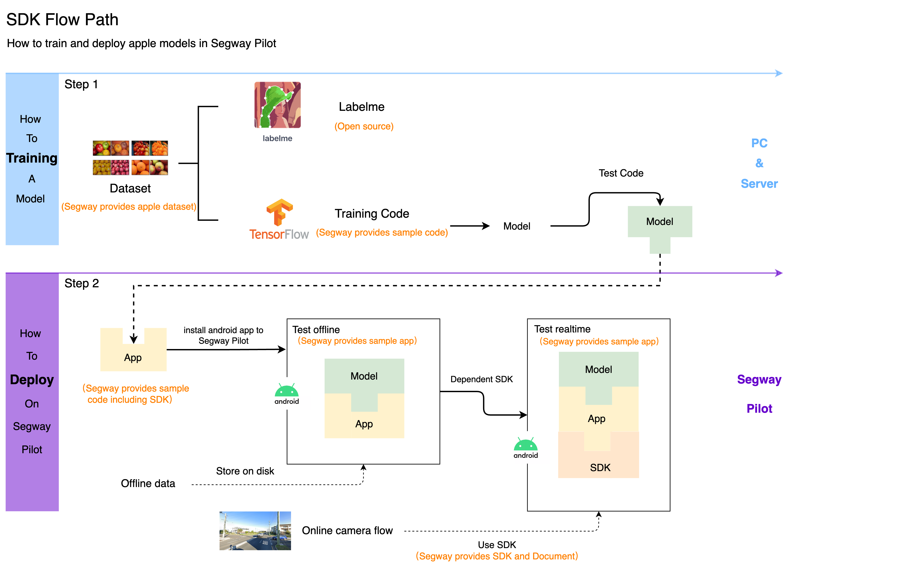
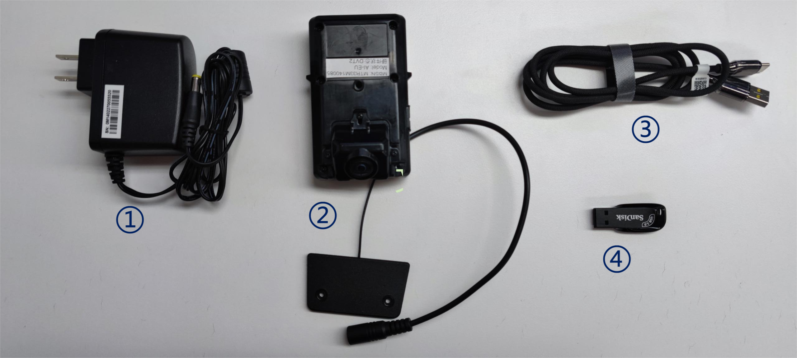
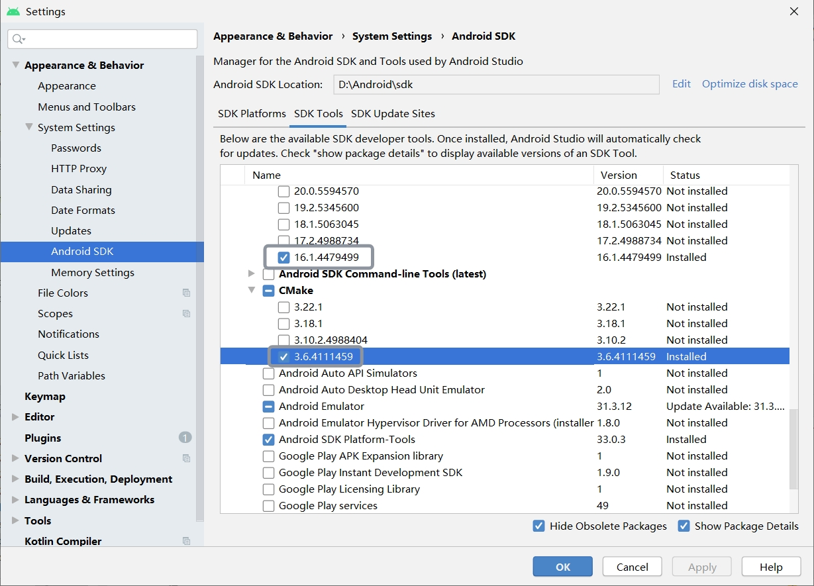
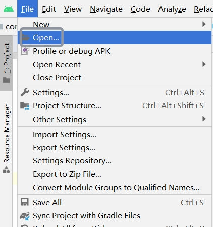
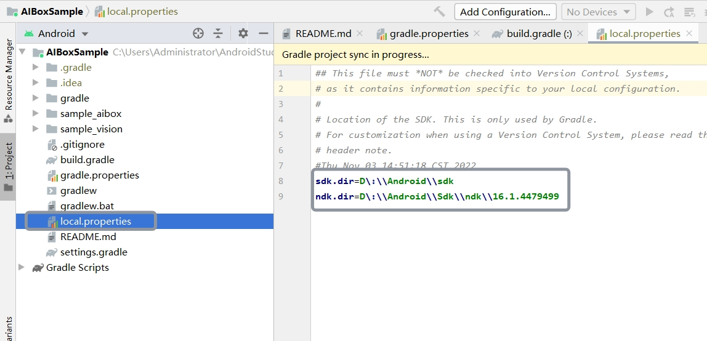

# Segway Pilot SDK (Preview for Alpha Version)
  
SDKs that support to develop and deploy  AI models on Segway Pilot.  

# I. SDK Flow Path


# II. Development Kit Devices
## 1. Contents of Development Kit


|SN|Content|Qty|Use|
|:-----:|:-------|:------:|:------|
|1|Power adapter|1|Power supply for Segway Pilot device|
|2|Segway Pilot|1|Pilot hardware device with Android OS|
|3|Type-c USB cable|1|Connecting PC and device for debugging|
|4|32G USB drive|1|Built-in dataset, building software, partial document description|

## 2. USB drive contents
  
|SN|Content|Use|
|:-----:|:-------|:------|
|1|android debug|Segway Pilot debugging tool|
|2|dataset|Apple dataset (labeled)|
|3|Software|Software development tools: IDE and JDK|
|4|Document|Github site of sample code |


# III. Train an AI model for apple detection (eg. Ubuntu)  
Project site: https://github.com/SegwayRoboticsSamples/AppleDetectionSample  
> Below we demonstrate how to take training an apple classification model and verify the effectivity of the model.

## 1. Labelme annotation software
The annotation software site: https://github.com/wkentaro/labelme  
> The apple’s dataset on the USB drive has already been annotated.


## 2. Environment setup for AI model training (based on Tensorflow)
### **a. Install Miniconda**  
Run the command in Terminal line by line: 
```
wget https://repo.anaconda.com/miniconda/Miniconda3-latest-Linux-x86 _64.sh
chmod +x Miniconda3-latest-Linux-x86_64.sh
./Miniconda3-latest-Linux-x86_64.sh
```
Prompt for successful installation: “Thank you for installing Miniconda3!”.

### **b. Setup the training environment** 
Run the command in Terminal line by line:  
> requirement.txt can be found in the root path of apple detection sample code (https://github.com/SegwayRoboticsSamples/AppleDetectionSample).
```  shell  
conda create -n sidewalk_perception python==3.6.13
conda install tensorflow-gpu==1.12.0
pip install -r requirement.txt
```  

### **c. Install CUDA**  
Nvidia CUDA download site: https://developer.nvidia.com/cuda-downloads.
Select the corresponding toolkit version according to the actual system version.

Other CUDA installation tutorial references:   
https://towardsdatascience.com/deep-learning-gpu-installation-on-ubuntu-18-4-9b12230a1d31

### **d. Download and install visual studio code compiler** 
Official download site: https://code.visualstudio.com/  
```
// Install vscode 
sudo dpkg -i code_1.62.0-1635954068_amd64.deb 
// Open vscode 
code ./xx
```

## 3. Train an apple classification model
### **a. Distribute the dataset ratio**
Distribute the annotated data with a ratio of 4:1, thus 80% for training and 20% for test.
```
└── data
    ├── train
    └── test
```

### **b. Generate .tfrecord file**
Copy all of the files in `/data` path into the project (need to decompressed first). Modify the path values of `data_dir`（`data_dir` is the path of the dataset `/data/train` folder）and `output_path` parameters in the following file (`dataset_tools/generate_apple_dataset.sh`) and run it，and the corresponding `.tfrecord` file of the dataset will be generated in the `output_path`.
```
dataset_tools/generate_apple_dataset.sh
#!/bin/sh
workspace=$(cd "$(dirname "$0")";pwd)
python $workspace/create_apple_tf_record.py \
    # data_dir Fill in the path of the train folder under the dataset
    --data_dir '/raid/data/object_detect/Apple_221019/train' \
    --from_database 0 \
    --data_family 'original' \
    # output_path Fill in the output tfrecord path
    --output_path './tf_record/Apple_221019/20221019' \
    --visual_dir './visualization' \
    --tfrecord_width 512 \
    --tfrecord_height 512
```

### **c. Training**
i. Modify the parameter `# change` in `config/train.yaml` (in the project root path).  
```
config/train.yaml
# change
data_dir: "./tf_record/Apple_221019/"

# change
exp_dir: "./models/experiment-AiBox-Apple-model-mbv1-0.25-20221102/"
```
ii. Run `teacher_train.py` in Terminal to start training.
``` 
python teacher_train.py
```

### **d. Generate .tflite file**
Modify the following parameters in the file `generate-tflite-float-model.sh` (in the project root path):  
``` 
--input_checkpoint
--output_graph

--output_file
--graph_def_file
```
`generate-tflite-float-model.sh` file content
```
export CUDA_VISIBLE_DEVICES='2'

freeze_graph \
  --input_graph=./models/experiment-AiBox-Apple-model-mbv1-0.25-20221017-num1/graph_eval.pbtxt \
  --input_checkpoint=./models/experiment-AiBox-Apple-model-mbv1-0.25-20221019/model.ckpt-571130 \
  --output_graph=./best_distillation_float_model_folder/frozen_eval_apple_graph-571130.pb \
  --output_node_names=head/reg13x13_output/BiasAdd,head/reg26x26/BiasAdd,head/reg52x52/BiasAdd
echo "freeze graph done."

tflite_convert \
  --output_file=./best_distillation_float_model_folder/frozen_eval_apple_graph-571130.tflite \
  --graph_def_file=./best_distillation_float_model_folder/frozen_eval_apple_graph-571130.pb \
  --input_arrays=Placeholder \
  --output_arrays=head/reg13x13_output/BiasAdd,head/reg26x26/BiasAdd,head/reg52x52/BiasAdd
echo "tflite convertion done."
```
Enter the following command in Terminal to generate a `.tflite` file in `best_distillation_float_model_folder/` path.
```
sh ./generate-tflite-float-model.sh
```

### **e. Verification**
Modify the parameter `# change ` in `config/inference.yaml` based on the actual results of output path.  
```
config/inference.yaml
# change
tflite_mode_path: "./best_distillation_float_model_folder/frozen_eval_apple_graph-571130.tflite"

# change
test_img_folder: "/raid/data/object_detect/Apple_221019/test"

# change
output_dir : "./result_apple"
```
Run `./inference.sh` to show the detection result in `result_apple/.`
```
./inference.sh
```


# IV. Deploy the AI model (eg. Windows)  
Project site: https://github.com/SegwayRoboticsSamples/AIBoxSample  
## 1. Setup android development environment  
### **a. Download and install jdk-1.8.0_311, and configure the environment variables**
i. Install JDK  
**Method I:**  
Find the jdk-8u311-windows-x64.exe installation package in the USB drive software path.  
**Method II:**  
Download from the official website:
https://www.oracle.com/java/technologies/downloads/#license-lightbox

ii. Configuration of environment variables  
(1) Open windows environment variable configuration, create `JAVA_HOME` variable and enter JDK installation path.
```
Variable Name: JAVA_HOME
Variable Value: JDK install location (eg. C:\Program Files\Java\jdk1.8.0_311)
```
(2) Add the following two items to the system environment variable `path`
```
Variable Name: PATH 
Variable Value: %JAVA_HOME%\bin;%JAVA_HOME%\jre\bin
```
(3) Click "Apply" and "OK" to enable configuration.   
(4) Open Terminal and enter `java -version` to confirm whether the jdk is successfully configured. The following figure shows that the configuration is successful.


### **b. Download Android Studio (4.0.2)**
**Method I:**  
Find the android-studio-ide-193.6821437-windows.exe installation package in the USB drive software path.   
**Method II:**  
Download version 4.0.2 at Android website:
[Download Android Studio & App Tools - Android Developers](https://developer.android.google.cn/studio)

### **c. Install Android Studio (4.0.2)**
Click “Install” and “Next Step” until the installation is completed.  
> Click Tools -> SDK Manager -> SDK Tools  
> Click "Show Package Details" in the lower right corner, select the NDK item (version is 16.1.447), select the CMake item (version is 3.6.4), then click "Apply" to start the installation.

 
## 2. Import and use sample app project
### **a. Import AIBoxSampleProject**
i. clone project
```
git clone https://github.com/SegwayRoboticsSamples/AIBoxSample.git
```
ii. Use Android Studio to open the sample project   


### **b. Compile the project**
If fail to compile the project and prompt `NDK not configured`.   
i. Refer to the Android Studio to download and install the NDK.  
ii. Find the NDK path from the installation directory, and add NDK path into the `local.properies`(in the project root path, if not exist, create it) file. Reference Code:  
```
ndk.dir=D\:\\android\\Sdk\\ndk\\16.1.447499  (Change D:... to your installation path)
```
  

## 3. Run AIBoxSample on Segway Pilot 
Rename the trained AI model file to `apple_model.tflite`. Run the command below.
``` 
adb push apple_model.tflite sdcard/slam_config
```  
Find a apple image from test dataset and copy it into current path. Rename the copied file to `apple.jpeg`, run the follow command.  
```
adb push apple.jpeg sdcard
```
  
### **a. Use adb and scrcpy to debug Segway Pilot**  
The tools `adb` and `scrcpy` can be found in the folder of the USB drive  titled `android debug`, copy it to your PC and unzip it.
> Tips：  
> (1) Please configure the environment variable of adb system before use.   
> (2) scrcpy website：https://github.com/Genymobile/scrcpy
### **b. Detect an apple image**
> Make sure you have already copied the `apple.jpeg` image from your PC into `sdcard/`  of Segway Pilot.  

Click the button `OPEN LOCAL IMAGE` and `START` next，the apple detected will be shown with a green rect. 

### **c. Real-time apple detection**
Click the button `OPEN THE CAMERA` and `START` next to start real-time apple detection, and the apple detected will be covered with a real-time green rect.

# V. FAQ

1. If the message `...path filename too long` is shown during `git clone`, run the following command in Terminal to solve this problem. 
    ```
    git config --system core.longpaths true
    ```

2. Solution for `Invalid keystore format` when running sample_aibox APP:  
Close Android Studio, delete the folder `C:/Adm.../.android`, and then reopen Andorid Studio to regenerate the `keystore` file .

# VI. Open source license
Apache 2.0
